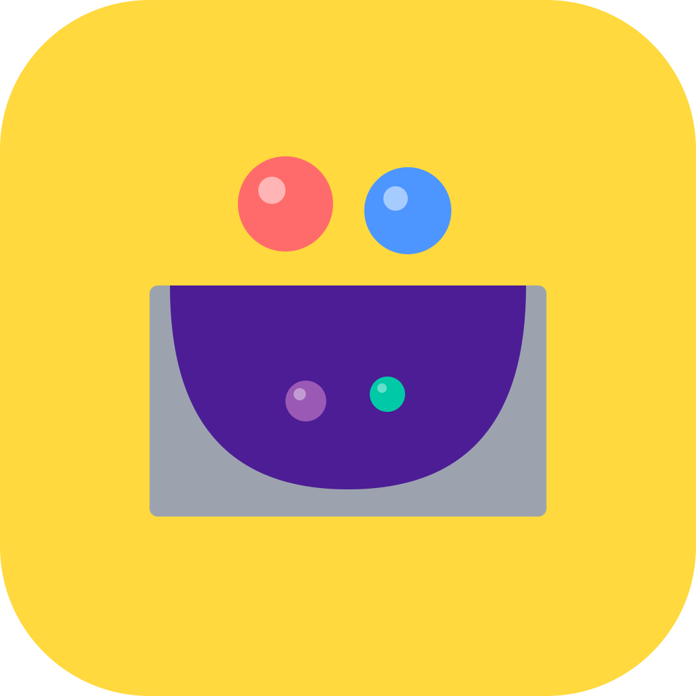

<p align="center">
  
</p>

# Pensine

[](https://github.com/FrenchCommando/pensine/actions/workflows/ci.yml)
[](https://github.com/FrenchCommando/pensine/actions/workflows/integration.yml)
[](https://github.com/FrenchCommando/pensine/actions/workflows/artifacts.yml)
[](https://github.com/FrenchCommando/pensine/actions/workflows/deploy.yml)
[](https://github.com/FrenchCommando/pensine/actions/workflows/release.yml)

A fun, visual notes app where ideas float as marbles. Drag, fling, and tap your way through different board types — lofi vibes, gamified interactions, no backend required.

**Try it now:** [frenchcommando.github.io/pensine](https://frenchcommando.github.io/pensine/)

**Website:** [frenchcommando.github.io/pensine/site](https://frenchcommando.github.io/pensine/site/)

> Store listings are a slog to get through, so the links below point to testing platforms instead. That's actually the better deal — builds come straight from the release workflow, completely transparent.

**Android beta** — to install via Play Store:
- [Testers group](https://groups.google.com/g/pensine-testers) — join first (required for access)
- [Play Store](https://play.google.com/store/apps/details?id=com.frenchcommando.pensine) — install on Android
- [Web](https://play.google.com/apps/testing/com.frenchcommando.pensine) — enrol from any browser

Or sideload the [latest APK](https://github.com/FrenchCommando/pensine/releases/latest) — enable "Install unknown apps" for your browser when prompted.

**iOS beta (TestFlight):** [join the beta](https://testflight.apple.com/join/KDHvbWKH) — tap the link on iPhone/iPad; installs the TestFlight app if needed.

**Windows:** requires **Windows 10 (version 1809) or later, on an x64 PC or Windows 11 ARM64**. Two options on the [latest release page](https://github.com/FrenchCommando/pensine/releases/latest):

- `pensine-v*-setup.exe` — **installer (recommended for most users)**: Start Menu entry, `.pensine` file association, proper uninstaller.
- `pensine-v*-windows.zip` — **portable build**: extract anywhere, run `pensine.exe`. Use this for USB-stick installs, locked-down PCs where you can't run installers, or to leave no trace on the host machine.

Both are unsigned while Microsoft Store listing is pending — SmartScreen warns on first launch; click "More info → Run anyway".

To uninstall the installer build: Settings → Apps → Pensine → Uninstall (or use the "Uninstall Pensine" shortcut in the Start Menu folder). Removes all installed files and the `.pensine` file association. Your boards and workspaces live under `%APPDATA%\pensine\` and are kept on uninstall — delete that folder by hand if you want a clean wipe, or use the in-app **About → Reset** before uninstalling. To uninstall the portable zip: just delete the extracted folder.

## Board Types

- **Thoughts** — free-form notes that expand on tap
- **To-do** — tap to catch in the net (mark done), reset to release all
- **Flashcards** — tap to flip, double-tap when correct (shrinks to net), grows on wrong answer
- **Steps** — sequential checklist with numbered marbles, one active at a time

## Workspaces

Boards are grouped into workspaces — collections of related boards (e.g. Cooking Recipes, French Vocab, Pilot Checklists). Create, rename, recolor, and reorder workspaces from the home screen. Export a whole workspace as a single `.pensine` file.

## Features

- Dark/light theme toggle
- Drag and fling marbles around the screen
- Shake button to scatter
- Per-board accent color (tints title, net, and icon)
- Color picker and size slider per item
- Reorder boards by long-press drag on the home screen
- Rename, duplicate, or change board type from the popup menu
- Swipe to delete with undo, or delete from menu with confirmation
- Export/import boards as `.pensine` files
- Installable as a PWA on mobile and desktop

## Stack

- Flutter / Dart
- Local storage only (no backend, no account)

## Development

```bash
flutter run -d chrome    # web
flutter run -d windows   # desktop
```

## Deployment

Web builds deploy automatically to GitHub Pages on every push to `main` via GitHub Actions. Installable as a PWA on mobile and desktop.

## License

All Rights Reserved. See [LICENSE](LICENSE).
